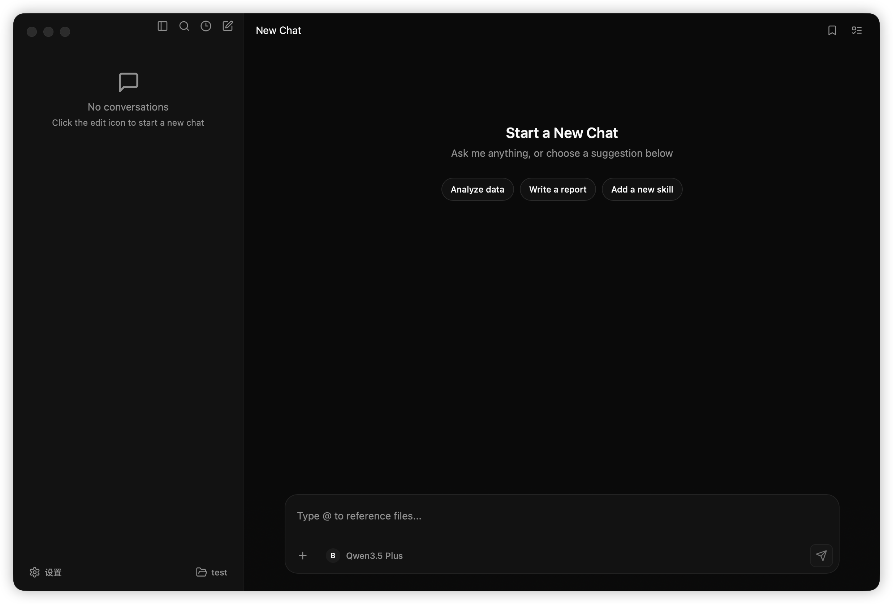
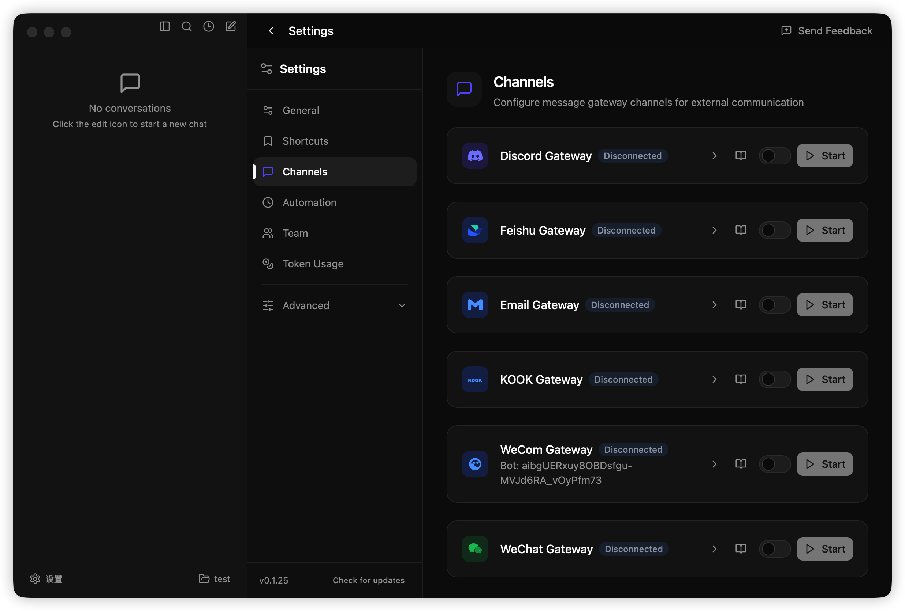
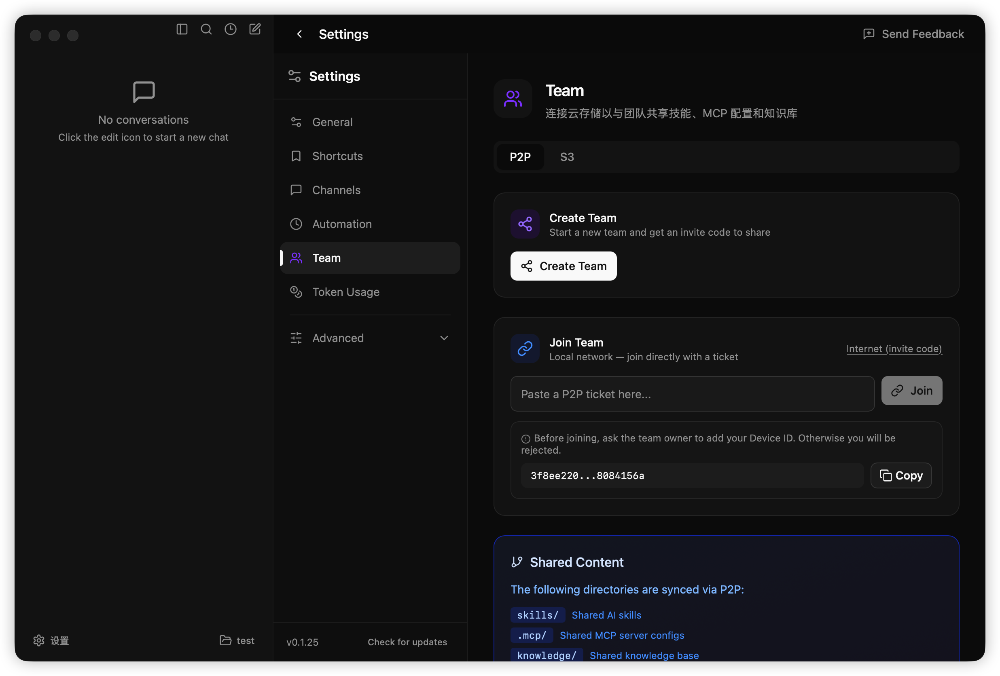

# TeamClaw

基于OpenCode打造的本地智能体，数字员工的基座

[English](README.md) | 简体中文 | [繁體中文](README.zh-TW.md) | [日本語](README.ja.md) | [한국어](README.ko.md)

## 功能特性

- **三栏布局** — 侧边栏、聊天区、详情面板
- **OpenCode 集成** — 完整的 Agent 能力支持
- **渠道网关** — 支持 Discord、Feishu、Email、Kook、WeCom、WeChat
- **自动化任务** — 支持定时任务（Cron）
- **团队协作模式** — 支持 P2P 与 S3/OSS
- **MCP 支持** — Model Context Protocol，连接企业系统
- **Skills / 插件扩展** — 可扩展的技能系统
- **知识库能力** — knowledge 文档索引与检索
- **本地文件操作** — 带权限管理的文件读写

## 界面截图

### 主页



### 频道



### 团队



## 技术栈

- **桌面端**：Tauri 2.0 (Rust)
- **前端**：React 19 + TypeScript
- **样式**：Tailwind CSS 4
- **状态**：Zustand
- **Agent**：OpenCode
- **编辑器**：Tiptap (Markdown/HTML)、CodeMirror 6 (代码)
- **Diff**：自定义 Diff 渲染器，Shiki 语法高亮

## 安装

从 [GitHub Releases](https://github.com/diffrent-ai-studio/teamclaw/releases) 下载对应平台的安装包（macOS 为 `.dmg`，Windows 为 `.exe`）。

- **Windows 用户**：详见 [Windows 安装指南](docs/windows-install-guide.md)。

### macOS 提示「已损毁」时

若从网上下载安装后打开应用时提示 **「已损毁」** 或 **「无法打开，因为无法验证开发者」**，是 macOS 安全策略（Gatekeeper）导致的。在终端执行以下命令即可解除限制并正常打开：

```bash
xattr -cr /Applications/TeamClaw.app
```

然后即可正常打开 TeamClaw。若仓库配置了 Apple 开发者签名与公证，则无需此步骤。

## 开发

### 前置要求

- Node.js >= 20
- pnpm >= 10
- Rust >= 1.70
- OpenCode CLI

### 安装 OpenCode CLI

```bash
# macOS / Linux
curl -fsSL https://opencode.ai/install | bash

# 或者通过 npm 安装
npm install -g opencode
```

### 快速开始

```bash
# 1. 安装依赖
pnpm install

# 2. 下载 OpenCode sidecar 二进制（必需，不在 git 中）
./src-tauri/binaries/download-opencode.sh

# 3. 启动 Tauri 开发模式
pnpm tauri dev
```

启动后，在 TeamClaw 界面中选择一个 Workspace 目录即可。

### 更新 OpenCode

OpenCode 发版频繁，随时可以一条命令更新到最新版：

```bash
pnpm update-opencode
```

如果已是最新版会自动跳过。也可以指定版本：`pnpm update-opencode -- v1.2.1`

> **开发模式（可选）**：也可以不下载 sidecar，而是单独运行 OpenCode Server：
>
> ```bash
> cd /path/to/your/workspace && opencode serve --port 13141
> OPENCODE_DEV_MODE=true pnpm tauri dev
> ```

## 团队协作

TeamClaw 支持多种团队协作方式：

- **P2P 模式**：基于票据加入局域网团队，支持成员角色管理
- **S3/OSS 模式**：基于对象存储的团队同步

### 配置团队共享仓库

1. 打开 **Settings** > **Team**
2. 输入团队 Git 仓库地址（支持 HTTPS 或 SSH）
3. 点击「连接」按钮
4. TeamClaw 会自动：
   - 初始化本地 Git 仓库
   - 拉取远程仓库内容
   - 生成白名单 `.gitignore`（只同步共享层目录）

### 共享内容

团队仓库会自动同步以下内容：

- **Skills**：`skills/` — 共享的 Agent 技能
- **MCP 配置**：`.mcp/` — MCP 服务器配置
- **知识库**：`knowledge/` — 团队知识库文档

个人文件和工作区配置不会被同步，确保隐私安全。

### 自动同步

- 应用启动时自动同步最新内容
- 可在 Settings > Team 中手动触发同步
- 查看最后同步时间

### 注意事项

- 工作区不能已有 `.git` 目录（避免冲突）
- 需要配置 Git 认证（SSH key 或 HTTPS token）
- 共享层文件以远程仓库为准，本地修改会被覆盖

### 开发命令

```bash
# 仅启动前端（不含 Tauri）
pnpm dev

# 启动完整 Tauri 应用
pnpm tauri dev

# 或使用别名
pnpm tauri:dev
```

### 构建

```bash
pnpm tauri:build
```

### 测试

#### 单元测试

```bash
# 运行所有单元测试
pnpm test:unit

# 监听模式运行测试
pnpm --filter @teamclaw/app test:unit --watch
```

#### E2E 测试（Tauri-mcp）

E2E 测试使用 `tauri-mcp` 与运行的 Tauri 应用交互，提供原生 UI 自动化。

**前置要求：**

- 安装 `tauri-mcp`：`cargo install tauri-mcp`
- 构建 Tauri 应用：`pnpm tauri:build`

**运行 E2E 测试（需在仓库根目录；需先构建 Tauri 应用并安装 tauri-mcp）：**

```bash
# 运行全部 E2E
pnpm test:e2e

# 按分类运行
pnpm test:e2e:regression
pnpm test:e2e:performance
pnpm test:e2e:e2e
pnpm test:e2e:functional

# 仅 Smoke
pnpm test:smoke
```

详见 `[packages/app/e2e/README.md](./packages/app/e2e/README.md)` 与 `tests/` 目录。

## 项目结构

```
teamclaw/
├── packages/
│   └── app/                 # React 前端
│       └── src/
│           ├── components/
│           │   ├── editors/      # 文件编辑器
│           │   ├── diff/         # Diff 渲染器
│           │   └── ...           # 其他 UI 组件
│           ├── hooks/
│           ├── lib/
│           ├── stores/
│           └── styles/
├── src-tauri/              # Tauri 后端
│   └── src/
│       └── commands/       # Rust 命令
├── doc/                    # 文档
└── package.json
```

## 编辑器架构

文件编辑器根据文件类型路由到不同的专用编辑器：

- **Markdown 文件**（`.md`、`.mdx`）：Tiptap 所见即所得编辑器，支持 Markdown 扩展、预览切换和剪贴板图片粘贴上传
- **HTML 文件**（`.html`、`.htm`）：Tiptap HTML 编辑器，沙箱 iframe 预览
- **代码文件**（其他类型）：CodeMirror 6，语法高亮、行号、代码折叠和 Git gutter 装饰

### Diff 渲染器

自定义 Diff 渲染器提供 Agent 优先的代码审查体验：

- 将 unified diff 解析为结构化 AST（文件 > hunk > 行）
- 支持行级、hunk 级和文件级选择
- 与 Agent 聊天集成，「发送给 Agent」支持：Review、Explain、Refactor、Generate Patch
- 大文件 diff 虚拟滚动（基于 IntersectionObserver 懒加载）
- 通过 Shiki 语法高亮，按需加载语言

## License

MIT
